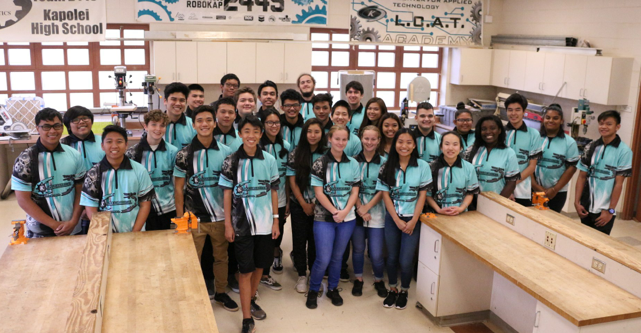

*"We make a living by what we get, we make a life by what we give." - Winston Churchill*

## The Inspiration

When I was in highschool, I was proudly a member of Kapolei High School's FRC team. I was taught many things in the three years I was on the team. This knowledge was passed down to me from the wonderful alumni of the team who were mentoring us. One in particular was very unorthodox but it was his ways that passed down to me. In my third year on the team, my senior year of highschool, it struck me that I want to do what he did. I wanted to become a mentor to pass down what I have learned and what I will learn down the line to the next generation of students. This is how my journey to being a mentor started.

## The Challenge

I was busy between school and work and I was not able to attend as much as I would have liked. However, when I did get the chance, I would come in hoping to teach the students various amounts of things. However, this is where the problem occurs. How do I teach? How do I put this information in a simple manner to help the students better grasp the concept of this? Of course, this was not something I can find out in a matter of days. There are many things the mentor will want to teach to the students. I asked these questions to myself with each visit trying to find a better way to pass on my knowledge. 

## The Solution

So what was my solution to this? To take my time with learning through trial and error. I need to have patience with myself and be understanding if what makes sense to me does not make sense to them. Being able to teach effectively is a big feature that is hard to achieve. It takes a deep understanding of the subject at hand to allow you to put it in a simple way. One of my favorite quotes that I stumbled across during this challenge was:

*"If you can't explain it simply, you don't understand it well enough" - Albert Einstein*

I believe Albert Einstein quotes it in such an simple and understanding manner. If my student's do not understand the topic I am trying to teach, then that simply means I have to work on my understanding of the subject. A teaching method I tried out was to relate the topic to something more personal to the student. By using this method, I can make an analogy that not only helps the student understand, but to be further engaged with what they are doing.

## The Joy

After stressful weeks of trying to make the deadline, it is always such an amazing accomplishment to see the finished product. Everyone in the room just takes a deep breath and takes pride in what has been done. As a mentor, you feel proud that these were the students you helped that made this. I see a bright future for these students. They are all amazing, smart, and had a set goal since the beginning. What is even better is when you realize, you were able to help give these students a push to something beyond what they learn in school. I can go on and on about how great the students are, but let's give this a close. My goal is to be able to inspire one of these students to become a mentor just as a mentor inspired me.
