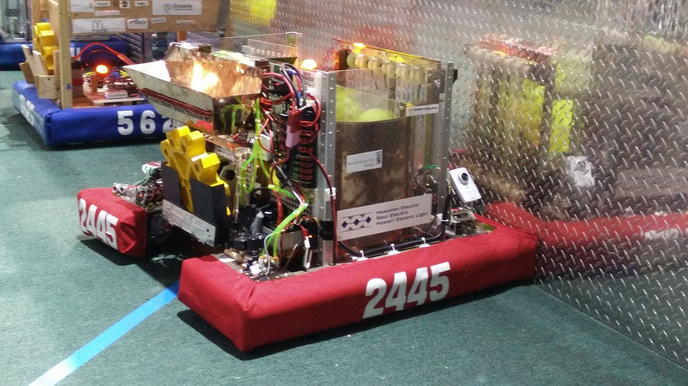
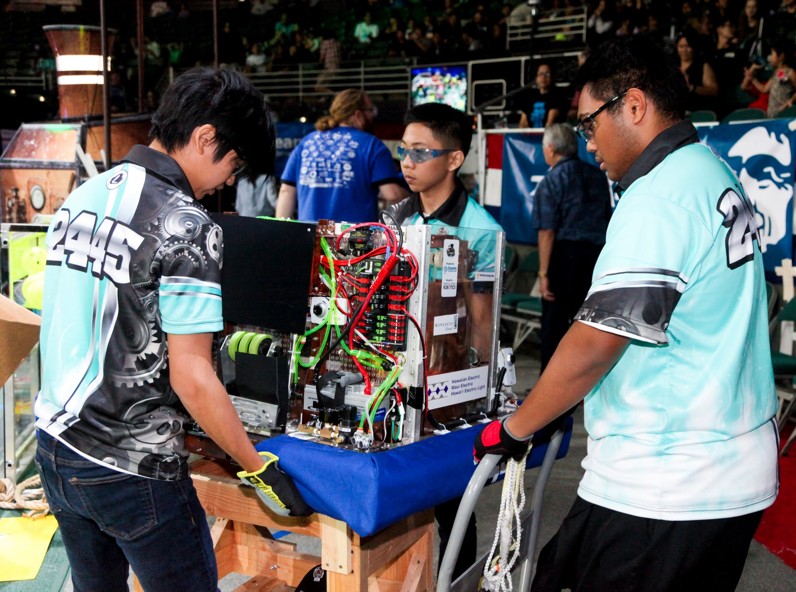
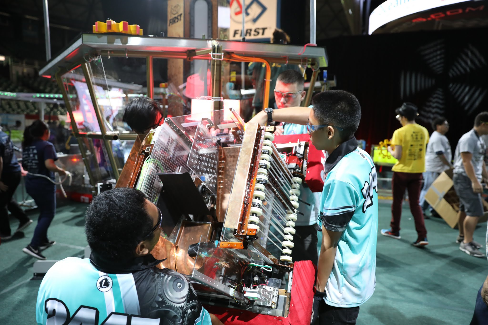

  
  
  

FIRST Robotics is an international competition help across the nation and at other countries such as China, Australia, etc. Hawaii is well known for hosting one of the most international competitions with teams coming from Taipei, Australia, Japan, Korea, and local teams in Hawaii. Each competition has qualifiers to either get to be in the top 8 or prove that they are worth being in the final alliances. Each alliance is composed of 3 teams that are then partnered with 3 other alliances to compose a Blue and Red group. These two groups then challenge each other to try and score the most points to win the round.

The team I was in, Kapolei, had 5 different subteams: mechanical, electrical, programming, design, and strategy. I myself, was on both mechanical and strategy. Mechanical was in charge of fabricating the parts and assembly of the robot. We used machines ranging from hand tools such as a screwdriver to big machines such as a mill. Strategy was a subteam made up of the top 4-6 students who have proved that they had the knowledge to make the big decisions that can make or break the robot. With that experience, I was able to learn how to thing outside the box to solve problems that arised when designing and prototyping mechanisms.

Now, for the problems our team faced but managed to overcome. There were numerous problems that came up as with many projects. The following are a couple of the major hurdles we faced and overcame:

<ul>
  <li> Climbing a rope to support 100+ pounds: We use a CIM motor with Versaplanetary gears that were made to create torque so that it was able to life the robot. Now the problem is, how did it stay there? To make it stay we added a ratchet to the end of the shaft so that it reeled one way. This was not a problem of the overall performance since this was the last maneuver of the round.</li>
  <li>Movement: This may sound like a simple problem, just toss on wheels and get it to move. In some ways, yes, that is correct. Except, this year required a lot of unique movements where we did not only have to move forward and back but left and right. To do this, we used a mecanum drive. This allowed us that lateral movement to more efficiently line ourselves up so that we did not take as long to do one task. To do this, it used 4 wheels and with the help of the programming team, worked beautiful. Using different electrical components programmed specifically to help the robot go laterally. You take the wheel that is diagonally across from the other, and use that technique to achieve it.</li>
</ul>

You can read comments from students from 2016's Kapolei team. (http://thevoiceofkapolei.com/kapolei-high-team-2445-robokap/).

