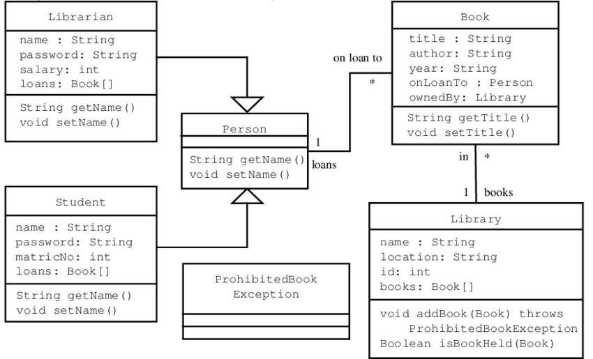

The library database is a project that I created for my final project in my first course of Java and for programming in general. For this porject, we were faced with the challenge to use inheritance and create classes that would store the patron's name, the book title, and the author of the book. This was a database created so that the user can keep track of the book that has been checked out and who checked it out. The user was also able to keep track of the date it was taken out and when it was supposed to be returned by. With the menu, the user was able to see all their patrons and books. They were also allowed to make edits to the names and authors in case there was any errors made during the initial adding of them.

This was a solo project that I had to tackle by myself. Since this was my first ever course and first time ever making a code, I ran into difficulties when making it. For one, inheritance can sometimes can get sometimes get tricky and hard to remember when you are dealing with multiple classes. For this, I create a Unified Modeling Language (UML) so that I was able to track what class had what attributes. Since this was my first real big project, I also ran into difficulties of getting the index of the book so that I was able to create a way for the user to easily pick the book they wanted to edit. Here was my final result after an extensive amount of time:

/**
 * Gets the title and author of a book.
 * 
 * @param title		Book's title.
 * @param author	Book's author.
 * @return		Title and author of selected book.
 */
public static int indexOfBook(String title, String author) {
	for(int i = 0; i < BookList.size(); i++) {
		if(BookList.get(i).getTitle().equals(title) && BookList.get(i).getAuthor().equals(author)) {
			return i;
		}	
	}
	return -1;

}
 
 
In the end, I was really proud of what I have accomplished. This class and this project made me who I am today, quite literally. It encouraged me to pursue Computer Science to explore the vast amounts of things you can do with it. It taught me problem solving skills and what goes on behind the scenes of those who create databases. This project really taught me that not everything can be solved when you face it once, but many many times. It made me take pride in my work and alwasy think of ways that I can improve on it. After more experience with coding, there is still much more that I could have done to further improve this.
 
# Source: <a href="https://github.com/theVacay/vacay"><i class="large github icon"></i>theVacay/vacay</a>
